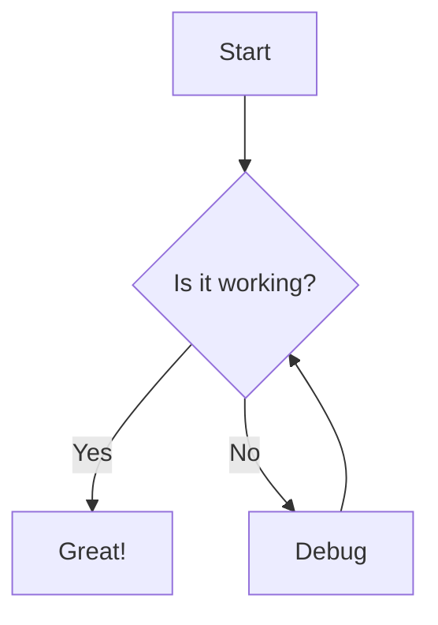
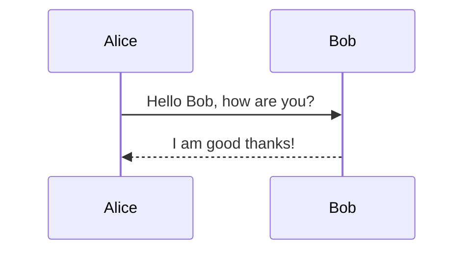
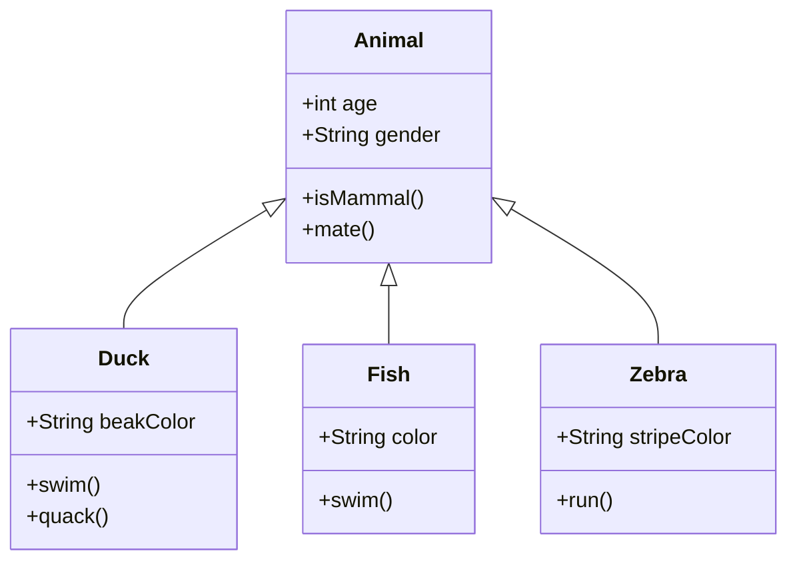
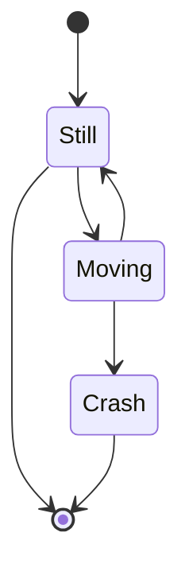
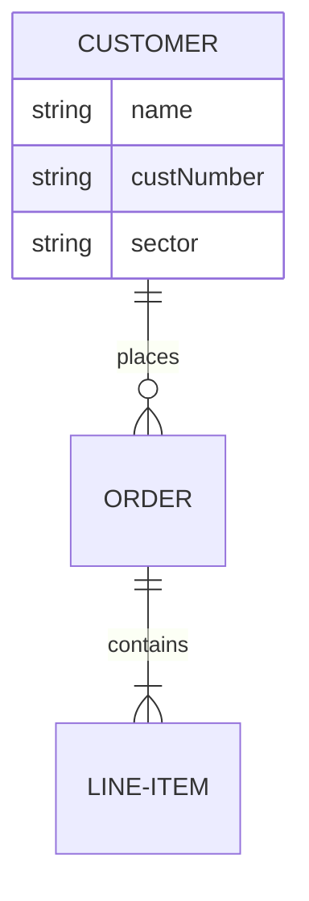
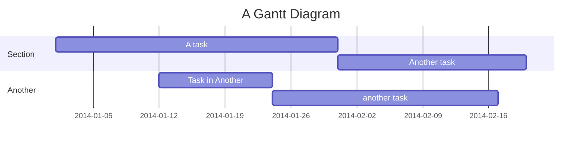
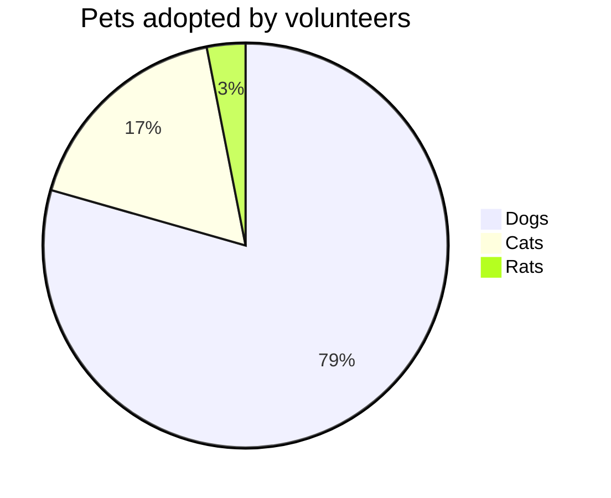
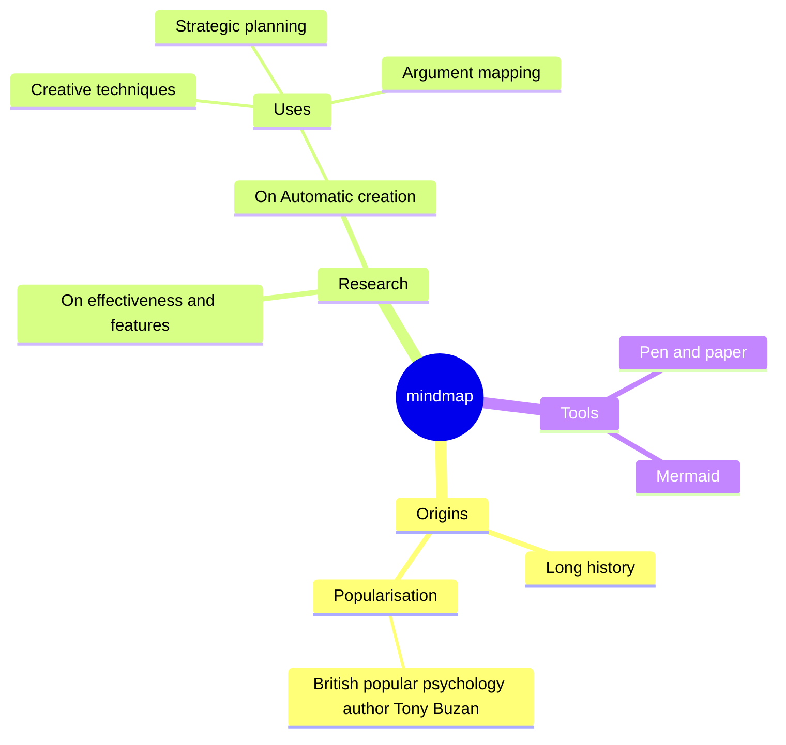
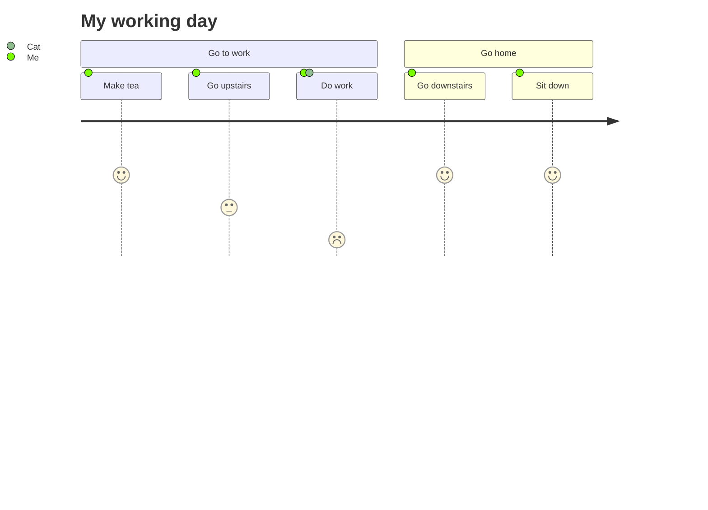
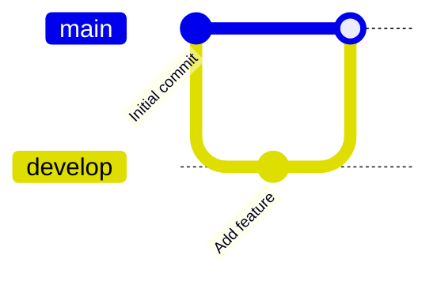

Use light mode for best diagram visuals.
{:.note}
Mermaid is a powerful tool for creating diagrams and visualizations using simple text-based syntax. It's great for documentation, presentations, and web content because it allows you to write diagrams in Markdown-like code that gets rendered as SVG graphics.

Like, check this out!
<pre class="mermaid">
pie title What Voldemort doesn't have?
         "FRIENDS" : 2
         "FAMILY" : 3
         "NOSE" : 45
</pre>
This chart is taken from [here.](https://docs.mermaidchart.com/mermaid-oss/syntax/examples.html#basic-pie-chart)
{:.note}

## Getting Started with Mermaid

To use Mermaid, you include a script tag in your HTML:

```html
<script src="https://cdn.jsdelivr.net/npm/mermaid@10/dist/mermaid.min.js"></script>
```

Then initialize it:

```javascript
mermaid.initialize({
    startOnLoad: true,
    theme: 'default', // options: 'default', 'dark', 'forest', 'neutral'
    securityLevel: 'loose', // 'strict', 'loose', 'antiscript' - for HTML in labels
    fontFamily: 'arial', // custom font family
    themeVariables: {
        primaryColor: '#ff0000', // customize theme colors
        primaryTextColor: '#fff',
        primaryBorderColor: '#7C0000',
        lineColor: '#F8B229',
        secondaryColor: '#006100',
        tertiaryColor: '#fff'
    },
    flowchart: {
        useMaxWidth: true,
        htmlLabels: true
    },
    sequence: {
        useMaxWidth: true
    }
});
```

You don't need to put all this, just the ones you need!

## Writing Mermaid Diagrams

Mermaid supports various diagram types like flowcharts, sequence diagrams, Gantt charts, and more. Here's a simple flowchart example:

<pre class="mermaid">
flowchart TD
    A[Start] --> B{Is it working?}
    B -->|Yes| C[Great!]
    B -->|No| D[Debug]
    D --> B
</pre>



### Sequence Diagrams
Great for showing interactions between actors over time.

<pre class="mermaid">
sequenceDiagram
    Alice->>Bob: Hello Bob, how are you?
    Bob-->>Alice: I am good thanks!
</pre>



### Class Diagrams
Perfect for object-oriented design.

<pre class="mermaid">
classDiagram
    Animal <|-- Duck
    Animal <|-- Fish
    Animal <|-- Zebra
    Animal : +int age
    Animal : +String gender
    Animal: +isMammal()
    Animal: +mate()
    class Duck{
        +String beakColor
        +swim()
        +quack()
    }
    class Fish{
        +swim()
        +String color
    }
    class Zebra{
        +run()
        +String stripeColor
    }
</pre>



### State Diagrams
For modeling state machines.

<pre class="mermaid">
stateDiagram-v2
    [*] --> Still
    Still --> [*]
    Still --> Moving
    Moving --> Still
    Moving --> Crash
    Crash --> [*]
</pre>



### Entity Relationship Diagrams
For database modeling.

<pre class="mermaid">
erDiagram
    CUSTOMER ||--o{ ORDER : places
    ORDER ||--|{ LINE-ITEM : contains
    CUSTOMER {
        string name
        string custNumber
        string sector
    }
</pre>



### Gantt Charts
For project timelines and schedules.

<pre class="mermaid">
gantt
    title A Gantt Diagram
    dateFormat YYYY-MM-DD
    section Section
    A task          :a1, 2014-01-01, 30d
    Another task    :after a1, 20d
    section Another
    Task in Another :2014-01-12, 12d
    another task    :24d
</pre>



### Pie Charts
For data visualization.

<pre class="mermaid">
pie title Pets adopted by volunteers
    "Dogs" : 386
    "Cats" : 85
    "Rats" : 15
</pre>



### Mind Maps
For brainstorming and organizing ideas.

<pre class="mermaid">
mindmap
  root((mindmap))
    Origins
      Long history
      ::icon(fa fa-book)
      Popularisation
        British popular psychology author Tony Buzan
    Research
      On effectiveness and features
      On Automatic creation
        Uses
            Creative techniques
            Strategic planning
            Argument mapping
    Tools
      Pen and paper
      Mermaid
</pre>



### User Journey
For user experience mapping.

<pre class="mermaid">
journey
    title My working day
    section Go to work
      Make tea: 5: Me
      Go upstairs: 3: Me
      Do work: 1: Me, Cat
    section Go home
      Go downstairs: 5: Me
      Sit down: 5: Me
</pre>



### Gitgraph
For visualizing Git branches.

<pre class="mermaid">
gitGraph
    commit id: "Initial commit"
    branch develop
    checkout develop
    commit id: "Add feature"
    checkout main
    merge develop
</pre>



## Advanced Configuration

Mermaid offers extensive customization options. Here are some key settings you can adjust:

### Themes
- `theme`: Choose from 'default', 'dark', 'forest', 'neutral'
- `themeVariables`: Override specific colors for fine-tuned styling

### Security and HTML
- `securityLevel`: 'strict' (no HTML), 'loose' (allow HTML), 'antiscript' (allow scripts)
- `htmlLabels`: Enable HTML in node labels

### Layout Options
- `flowchart.useMaxWidth`: Allow diagrams to expand to full width
- `sequence.useMaxWidth`: Same for sequence diagrams
- `gantt.useMaxWidth`: For Gantt charts

### Fonts and Styling
- `fontFamily`: Set custom font
- `themeVariables`: Customize colors, borders, backgrounds

You can also configure diagram-specific options like arrow styles, node shapes, and spacing.

## Integration Tips

- Mermaid diagrams are responsive and accessible
- They render as SVG, so they're scalable
- You can style them with CSS
- Many platforms like GitHub, GitLab, and documentation tools support Mermaid natively

Mermaid makes it easy to add professional-looking diagrams to your projects without needing graphic design skills. Just write the code, and let Mermaid handle the rendering!

Anyways, check out the full docs [here.](https://docs.mermaidchart.com/mermaid-oss/intro/index.html) There's so much more types of diagram that Mermaid can implement!